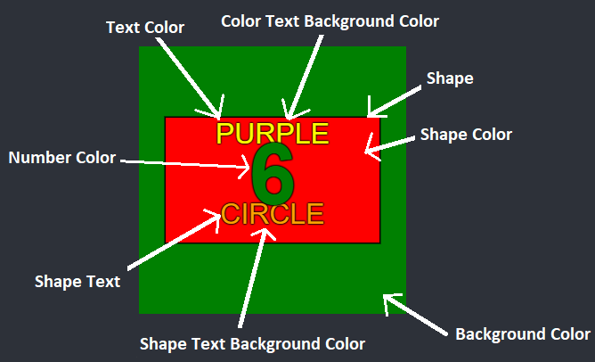
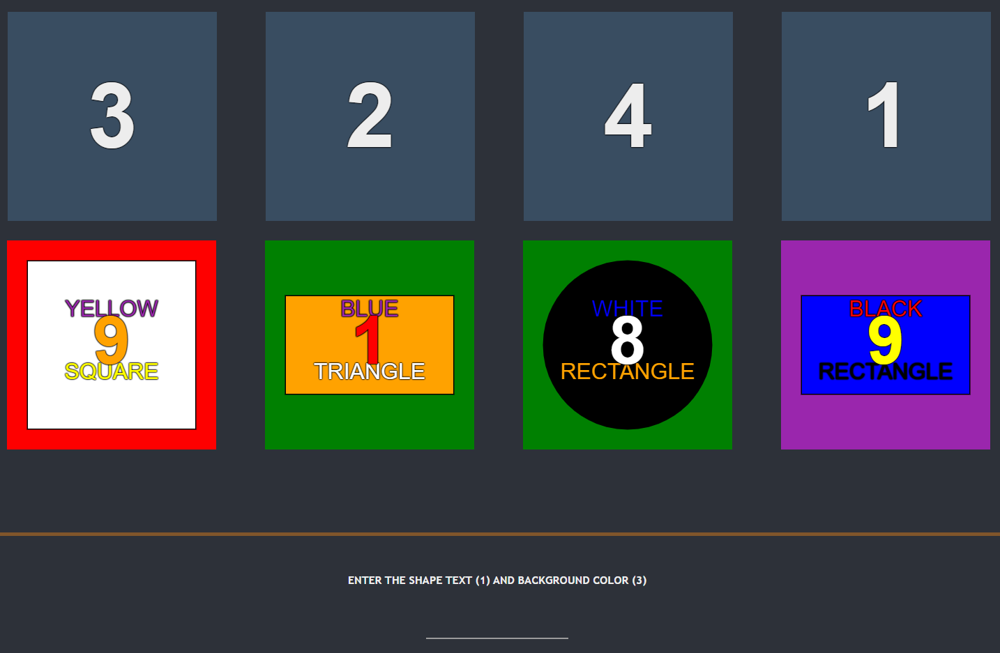

# NoPixel-Minigames
Recreation of the hacking minigames from the GTARP server NoPixel.

Thermite Hack
-------------

The thermite hack is a game of remembering where you must remember the highlighted squares within a short time frame, and then reproduce the pattern once the highlighted boxes have gone.
The thermite hack has four sizes, escalating in difficulty (including: 5x5, 6x6. 7x7 and 8x8).

Laptop Hack
------------

The laptop hack is a quick recognition game as well as testing your memory. A set of numbers will appear in blocks on screen for a short amount of time, which denotes an order to remember. You will then be asked two questions about a block and the number of the block that those questions refer to.

These questions include (See above image for reference on where these are found):
* Background Color
* Shape
* Shape Color
* Number Color
* Text Color
* Color Text Background Color
* Shape Text
* Shape Text Background Color

The questions will require simple inputs.
Colors options:
* Red
* Blue
* Green
* Yellow
* Orange
* Purple
* Black
* White

Shapes options:
* Triangle
* Circle
* Square
* Rectangle

So for example, the number order flashed at the beginning is "3 2 4 1". Once the numbers disappear, the lower group of blocks are shown, along with the question.
"SHAPE TEXT (1)" requires the shape text from block 1, therefore the answer is "rectangle". "BACKGROUND COLOR (3)" requires the background color of block 3, therefore the answer is "red". This would result in the user entering "rectangle red" into the input box and hitting enter.